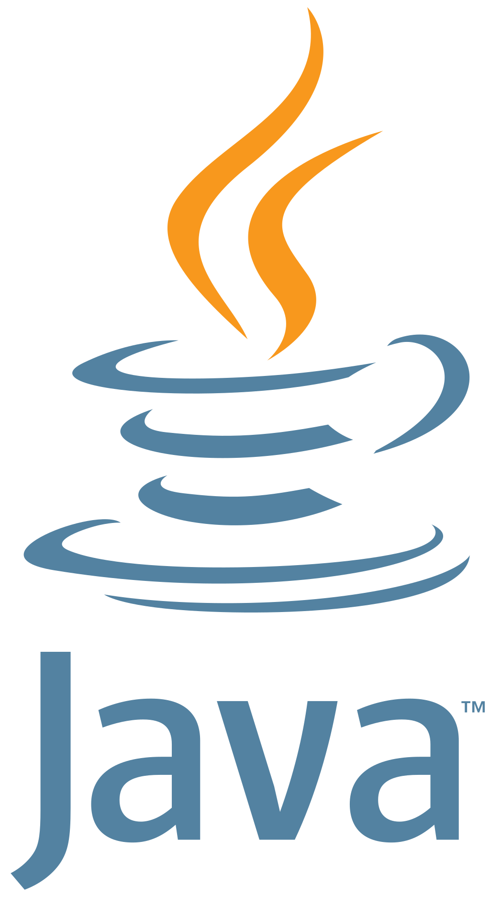

# Project-Euler-solutions

This repositorio contains solutions to Project Euler problems implmented in varios programming languajes

## Structure of the repository

The repository follows the following folder structure:

|                                                | Language                    | Number of Problems Solved / Total|
|------------------------------------------------|-----------------------------|--------------------------------- |
|        | [Java](./java/)             | `5 / 848`                        |
|     | [C#](./C%23/)               | `0 / 848`                        |
|  | [Javascript](./Javascript/) | `5 / 848`                        |
|      | [Python](./python/)         | `2 / 848`                        |

Inside each language folder, you will find a folder for each Project Euler problem, where the corresponding solution file is located.

| ID  | Title  | Dificulty | [Java](./java/)    | [C#](./C%23/) | [Javascript](./Javascript/) | [Python](./python/) |
|-----|--------|-----------|--------------------|---------------|-----------------------------|---------------------|
| 001 | [Multiples of 3 or 5](./doc/Problem001/README.md) | ◻◾◾◾◾◾◾◾◾◾ 5% | :white_check_mark: [Solution](./java/euler/src/main/java/io/angelsanchezt/euler/Problem001.java) |<!-- C# -->|✅ [Solution](./Javascript/problems/problem001.js)|✅ [Solution](./python/problem001.py)|
| 002 | [Even Fibonacci Numbers](./doc/Problem002/README.md) | ◻◾◾◾◾◾◾◾◾◾ 5% | :white_check_mark: [Solution](./java/euler/src/main/java/io/angelsanchezt/euler/Problem002.java) |<!-- C# -->|✅ [Solution](./Javascript/problems/problem002.js)|✅ [Solution](./python/problem002.py)|
| 003 | [Largest Prime Factor](./doc/Problem003/README.md) | ◻◾◾◾◾◾◾◾◾◾ 5% | :white_check_mark: [Solution](./java/euler/src/main/java/io/angelsanchezt/euler/Problem003.java) |<!-- C# -->|✅ [Solution](./Javascript/problems/problem003.js)|<!-- Python -->|
| 004 | [Largest Palindrome Product](./doc/Problem004/README.md) | ◻◾◾◾◾◾◾◾◾◾ 5% | :white_check_mark: [Solution](./java/euler/src/main/java/io/angelsanchezt/euler/Problem004.java) |<!-- C# -->|✅ [Solution](./Javascript/problems/problem004.js)|<!-- Python -->|
| 005 | [Smallest Multiple](./doc/Problem005/README.md) | ◻◾◾◾◾◾◾◾◾◾ 5% | :white_check_mark: [Solution](./java/euler/src/main/java/io/angelsanchezt/euler/Problem005.java) |<!-- C# -->|✅ [Solution](./Javascript/problems/problem005.js)|<!-- Python -->|
| 006 | [Sum Square Difference](./doc/Problem006/README.md) | ◻◾◾◾◾◾◾◾◾◾ 5% |<!-- JAVA -->|<!-- C# -->|<!-- JS -->|<!-- Python -->|
| 007 | [1001st Prime](./doc/Problem007/README.md) | ◻◾◾◾◾◾◾◾◾◾ 5% |<!-- JAVA -->|<!-- C# -->|<!-- JS -->|<!-- Python -->|
| 008 | [Largest Product in a Series](./doc/Problem008/README.md) | ◻◾◾◾◾◾◾◾◾◾ 5% |<!-- JAVA -->|<!-- C# -->|<!-- JS -->|<!-- Python -->|
| 009 | [Special Pythagorean Triplet](./doc/Problem009/README.md) | ◻◾◾◾◾◾◾◾◾◾ 5% |<!-- JAVA -->|<!-- C# -->|<!-- JS -->|<!-- Python -->|
| 010 | [Summation of Primes](./doc/Problem010/README.md) | ◻◾◾◾◾◾◾◾◾◾ 5% |<!-- JAVA -->|<!-- C# -->|<!-- JS -->|<!-- Python -->|
| 011 | [Largest Product in a Grid](./doc/Problem011/README.md) | ◻◾◾◾◾◾◾◾◾◾ 5% |<!-- JAVA -->|<!-- C# -->|<!-- JS -->|<!-- Python -->|
| 012 | [Highly Divisible Triangular Number](./doc/Problem012/README.md) | ◻◾◾◾◾◾◾◾◾◾ 5% |<!-- JAVA -->|<!-- C# -->|<!-- JS -->|<!-- Python -->|
| 013 | [Large Sum](./doc/Problem013/README.md) | ◻◾◾◾◾◾◾◾◾◾ 5% |<!-- JAVA -->|<!-- C# -->|<!-- JS -->|<!-- Python -->|
| 014 | [Longest Collatz Sequence](./doc/Problem014/README.md) | ◻◾◾◾◾◾◾◾◾◾ 5% |<!-- JAVA -->|<!-- C# -->|<!-- JS -->|<!-- Python -->|
| 015 | [Lattice Paths](./doc/Problem015/README.md) | ◻◾◾◾◾◾◾◾◾◾ 5% |<!-- JAVA -->|<!-- C# -->|<!-- JS -->|<!-- Python -->|
| 016 | [Power Digit Sum](./doc/Problem016/README.md) | ◻◾◾◾◾◾◾◾◾◾ 5% |<!-- JAVA -->|<!-- C# -->|<!-- JS -->|<!-- Python -->|
| 017 | [Number Letter Counts](./doc/Problem017/README.md) | ◻◾◾◾◾◾◾◾◾◾ 5% |<!-- JAVA -->|<!-- C# -->|<!-- JS -->|<!-- Python -->|
| 018 | [Maximum Path Sum I](./doc/Problem018/README.md) | ◻◾◾◾◾◾◾◾◾◾ 5% |<!-- JAVA -->|<!-- C# -->|<!-- JS -->|<!-- Python -->|
| 019 | [Counting Sundays](./doc/Problem019/README.md) | ◻◾◾◾◾◾◾◾◾◾ 5% |<!-- JAVA -->|<!-- C# -->|<!-- JS -->|<!-- Python -->|
| 020 | [Factorial Digit Sum](./doc/Problem020/README.md) | ◻◾◾◾◾◾◾◾◾◾ 5% |<!-- JAVA -->|<!-- C# -->|<!-- JS -->|<!-- Python -->|
| 021 | [Amicable Numbers](./doc/Problem021/README.md) | ◻◾◾◾◾◾◾◾◾◾ 5% |<!-- JAVA -->|<!-- C# -->|<!-- JS -->|<!-- Python -->|
| 022 | [Names Scores](./doc/Problem022/README.md) | ◻◾◾◾◾◾◾◾◾◾ 5% |<!-- JAVA -->|<!-- C# -->|<!-- JS -->|<!-- Python -->|
| 023 | [Non-Abundant Sums](./doc/Problem023/README.md) | ◻◾◾◾◾◾◾◾◾◾ 5% |<!-- JAVA -->|<!-- C# -->|<!-- JS -->|<!-- Python -->|
| 024 | [Lexicographic Permutations](./doc/Problem024/README.md) | ◻◾◾◾◾◾◾◾◾◾ 5% |<!-- JAVA -->|<!-- C# -->|<!-- JS -->|<!-- Python -->|
| 025 | [1000-digit Fibonacci Number](./doc/Problem025/README.md) | ◻◾◾◾◾◾◾◾◾◾ 5% |<!-- JAVA -->|<!-- C# -->|<!-- JS -->|<!-- Python -->|
| 026 | [Reciprocal Cycles](./doc/Problem026/README.md) | ◻◾◾◾◾◾◾◾◾◾ 5% |<!-- JAVA -->|<!-- C# -->|<!-- JS -->|<!-- Python -->|
| 027 | [Quadratic Primes](./doc/Problem027/README.md) | ◻◾◾◾◾◾◾◾◾◾ 5% |<!-- JAVA -->|<!-- C# -->|<!-- JS -->|<!-- Python -->|
| 028 | [Number Spiral Diagonals](./doc/Problem028/README.md) | ◻◾◾◾◾◾◾◾◾◾ 5% |<!-- JAVA -->|<!-- C# -->|<!-- JS -->|<!-- Python -->|
| 029 | [Distinct Powers](./doc/Problem029/README.md) | ◻◾◾◾◾◾◾◾◾◾ 5% |<!-- JAVA -->|<!-- C# -->|<!-- JS -->|<!-- Python -->|
| 030 | [Digit Fifth Powers](./doc/Problem030/README.md) | ◻◾◾◾◾◾◾◾◾◾ 5% |<!-- JAVA -->|<!-- C# -->|<!-- JS -->|<!-- Python -->|
| 031 | [Coin Sums](./doc/Problem031/README.md) | ◻◾◾◾◾◾◾◾◾◾ 5% |<!-- JAVA -->|<!-- C# -->|<!-- JS -->|<!-- Python -->|
| 032 | [Pandigital Products](./doc/Problem032/README.md) | ◻◾◾◾◾◾◾◾◾◾ 5% |<!-- JAVA -->|<!-- C# -->|<!-- JS -->|<!-- Python -->|
| 033 | [Digit Cancelling Fractions](./doc/Problem033/README.md) | ◻◾◾◾◾◾◾◾◾◾ 5% |<!-- JAVA -->|<!-- C# -->|<!-- JS -->|<!-- Python -->|
| 034 | [Digit Factorials](./doc/Problem034/README.md) | ◻◾◾◾◾◾◾◾◾◾ 5% |<!-- JAVA -->|<!-- C# -->|<!-- JS -->|<!-- Python -->|
| 035 | [Circular Primes](./doc/Problem035/README.md) | ◻◾◾◾◾◾◾◾◾◾ 5% |<!-- JAVA -->|<!-- C# -->|<!-- JS -->|<!-- Python -->|
| 036 | [Double-base Palindromes](./doc/Problem036/README.md) | ◻◾◾◾◾◾◾◾◾◾ 5% |<!-- JAVA -->|<!-- C# -->|<!-- JS -->|<!-- Python -->|
| 037 | [Truncatable Primes](./doc/Problem037/README.md) | ◻◾◾◾◾◾◾◾◾◾ 5% |<!-- JAVA -->|<!-- C# -->|<!-- JS -->|<!-- Python -->|
| 038 | [Pandigital Multiples](./doc/Problem038/README.md) | ◻◾◾◾◾◾◾◾◾◾ 5% |<!-- JAVA -->|<!-- C# -->|<!-- JS -->|<!-- Python -->|
| 039 | [Integer Right Triangles](./doc/Problem039/README.md) | ◻◾◾◾◾◾◾◾◾◾ 5% |<!-- JAVA -->|<!-- C# -->|<!-- JS -->|<!-- Python -->|
| 040 | [Champernowne's Constant](./doc/Problem040/README.md) | ◻◾◾◾◾◾◾◾◾◾ 5% |<!-- JAVA -->|<!-- C# -->|<!-- JS -->|<!-- Python -->|

## How to use the solutions

- Browse through the language folders and find the specific problem that interests you.
- Inside each problem folder, you will find a file with the solution implemented in that language.
- Examines and runs the solution file in an environment suitable for that language (dev environment, interpreter, browser, etc.).
- Please note that these solutions are already implemented, so we recommend that you try to solve the problems yourself before looking at these solutions.

## Contributions

Contributions are welcome! If you have a different or more efficient solution to a problem, or if you want to add solutions in other languages, feel free to do so.

1. Fork the repository.
2. Create a new branch for your contribution.
3. Add your solutions in the corresponding folder structure.
4. Make a pull request so we can review your contribution.

We look forward to seeing your contributions!

|◻◽▫◽▪◾◻◼